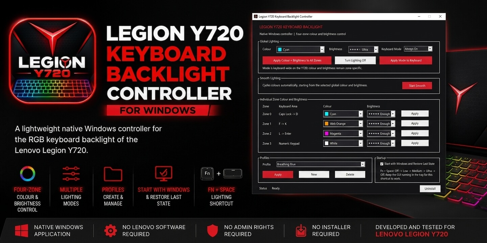
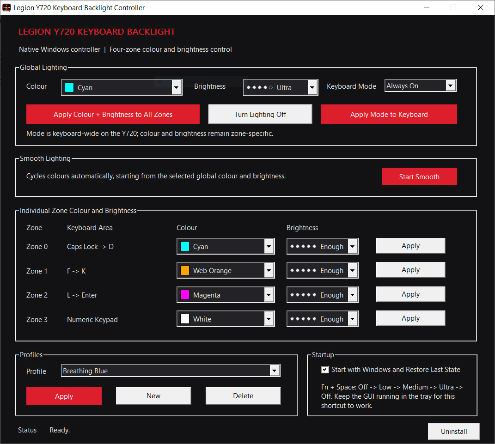

# Legion Y720 Keyboard Backlight Controller for Windows

<p align="center">
  
</p>

<p align="center">
  A lightweight native Windows controller for the RGB keyboard backlight of the Lenovo Legion Y720.
</p>

<p align="center">
  
</p>

This project was created as a replacement for Lenovo Nerve Center /
Nerve Sense after the original lighting software became unavailable or
unreliable on the Y720.

The controller communicates directly with the keyboard through the
Windows HID API and does not require Lenovo's proprietary lighting
software.

## Download

The latest release includes the standalone Windows executable and does
not require an installer.

- **[Download Latest Release](../../releases/latest)**
- **[View All Releases](../../releases)**
- **[Download Source Code](../../archive/HEAD.zip)**

## Features

-   Native Windows GUI
-   DPI-aware GUI layout
-   Four-zone independent colour control
-   Four-zone independent brightness control
-   Visual colour and brightness selectors
-   Keyboard-wide lighting modes
-   Smooth colour cycling
-   Profiles stored in an INI configuration file
-   Create and delete profiles from the GUI
-   Persistent lighting state
-   Restore the previous lighting state when Windows starts
-   Optional Start with Windows setting
-   Fn + Space keyboard shortcut
-   System-tray integration
-   Tray controls for turning lighting on and off
-   Single-instance application
-   Built-in uninstall and cleanup
-   No installer required
-   No background service required
-   No administrator privileges required
-   No Lenovo software required

## Lighting Control

### Global Lighting

The global controls can apply a colour and brightness setting to all
four keyboard zones simultaneously.

Keyboard lighting modes are keyboard-wide on the Y720. A mode cannot be
assigned independently to individual zones.

Zone-specific colour and brightness settings are preserved when changing
keyboard-wide modes.

### Individual Zones

The Y720 keyboard is divided into four controllable lighting zones:

-   Zone 0 --- Caps Lock to D
-   Zone 1 --- F to K
-   Zone 2 --- L to Enter
-   Zone 3 --- Numeric Keypad

Each zone can have its own colour and brightness.

### Smooth Lighting

Smooth mode continuously cycles the keyboard lighting through colours.

The currently selected global colour and brightness are used as the
starting state for the transition.

### Profiles

Profiles allow frequently used lighting configurations to be saved and
recalled.

Profiles can contain:

-   Four-zone colour settings
-   Four-zone brightness settings
-   Keyboard-wide lighting mode

Profiles can be applied, created and deleted directly from the GUI.

No predefined profiles are included with the release. Users can create
their own profiles when needed.

## Fn + Space

The controller implements the classic Legion-style:

**Fn + Space**

keyboard lighting shortcut.

Each press advances through the following lighting states:

``` text
Off → Low → Medium → Ultra → Off
```

If the lighting has been deliberately turned off, the next Fn + Space
press always starts at **Low**, rather than continuing from the previous
brightness level.

The four-zone colour configuration is preserved when cycling brightness.

### Important

The GUI must remain running in the Windows system tray for the Fn +
Space shortcut to work.

The application does not install a background service or keyboard driver
for this functionality.

## Persistent State

The controller saves the last-on lighting state so that it can be
restored when the application is restarted or Windows starts.

The saved state includes the configured zone lighting and other relevant
controller state.

The application can optionally be configured to start with Windows and
restore the previous lighting state automatically.

Normal Windows startup restoration occurs after the user session starts.
The application does not install a Windows service or require
administrator privileges solely for pre-login lighting control.

Turning lighting off does not discard the saved lighting configuration.
Turning it back on restores the previous state.

## System Tray

When minimized, the application can remain running in the Windows system
tray.

The tray menu provides quick access to:

-   Show the main window
-   Turn lighting on
-   Turn lighting off
-   Exit the application

Turning lighting off does not discard the current four-zone
configuration. Turning the lighting back on restores the previously
configured zone state.

## Single Instance

Only one instance of the controller can run at a time.

Launching the application again while it is already running brings the
existing instance to the foreground instead of starting a second copy.

## Uninstall

The application includes an **Uninstall** function in the GUI.

The uninstall process removes the application's configuration and
startup settings and cleans up the application files without requiring a
separate installer or administrator-level uninstaller.

## Compatibility

The controller was developed and tested specifically for:

- Lenovo Legion Y720
- Windows 10 / Windows 11
- 64-bit Windows

The tested keyboard lighting HID interface is:

Vendor ID:  048D
Product ID: 837A

Usage Page: FF89
Usage:      00CC

The lighting interface is specific to the Legion Y720 keyboard hardware.

## Reporting Compatibility

If you have a different Lenovo laptop that previously used Nerve Sense or Nerve Center, you are welcome to test the application and report the results.

Please include:

- Exact laptop model
- Windows version
- Whether the application launches
- Whether keyboard lighting responds
- Whether Fn + Space works
- Any unexpected behaviour or errors

## Installation

No installer is required.

Download the latest release, extract the release package, place the
executable in a convenient location, and run:

```text
Y720BacklightGUI.exe
```

The application can optionally be configured to start with Windows from
within the GUI.

The program does not require:

-   Lenovo Nerve Center
-   Lenovo Nerve Sense
-   Lenovo Vantage
-   A separate command-line controller
-   A Windows service
-   Administrator privileges

## Configuration

The application stores profiles and persistent settings in an INI
configuration file managed by the program.

Users normally do not need to create or edit this file manually. Profiles
can be created, applied, and deleted directly from the GUI.

No predefined profiles configuration is included with the release. A
fresh installation therefore starts without user profiles, and users can
create profiles only when they need them.

## Building from Source

The project is written in native C for Windows.

The supplied build script uses GCC and `windres` from a MinGW/MinGW-w64
environment.

Build requirements:

-   GCC
-   windres
-   Windows development libraries provided by the compiler environment

Run:

``` text
build.bat
```

The build produces:

``` text
build\\Y720BacklightGUI.exe
```

The GUI is compiled as a standalone executable from:

``` text
src\\Y720BacklightGUI.c
src\\Y720BacklightCore.c
src\\Y720BacklightHID.c
```

along with the Windows application resources.

The final GUI executable does **not** require the former
`Y720Backlight.exe` command-line tool.

## Project Structure

The main source components are separated as follows:

``` text
src/
    Y720BacklightGUI.c
    Y720BacklightCore.c
    Y720BacklightCore.h
    Y720BacklightHID.c
    Y720BacklightHID.h
    Y720BacklightGUI.rc

resources/
    keyboard.ico

build/
    (generated build output)
```

## Security and System Design

The controller is intentionally designed to remain lightweight and
minimally invasive.

It does not install:

-   Kernel drivers
-   Keyboard filter drivers
-   Background services
-   Scheduled privileged services
-   Lenovo software
-   Administrator-level components

The application communicates with the keyboard using the Windows HID
interface and performs its normal configuration and persistence tasks
from user space.

Configuration, profile names, paths, and startup settings are validated
and parsed defensively to reduce the risk of malformed or unexpected
input causing unintended behaviour.

## Why This Project Exists

The Lenovo Legion Y720 is a capable gaming laptop whose original
lighting software is no longer reliably available on modern Windows
installations.

Rather than depending on obsolete proprietary software, this project
provides a small native controller specifically designed around the
Y720's hardware.

The goal is to provide the functionality users actually need while
keeping the application simple, transparent and independent of Lenovo's
discontinued software.

## License

See the repository for the applicable license and project terms.
